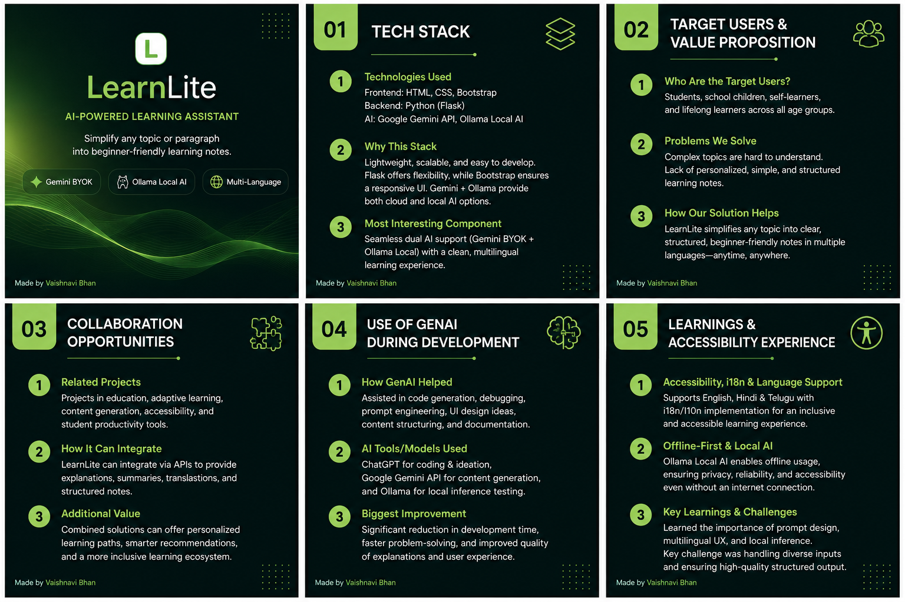
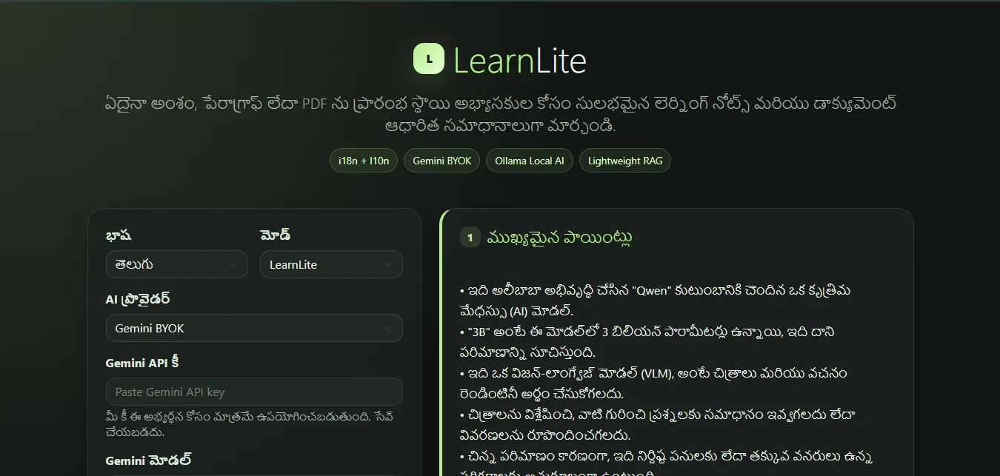
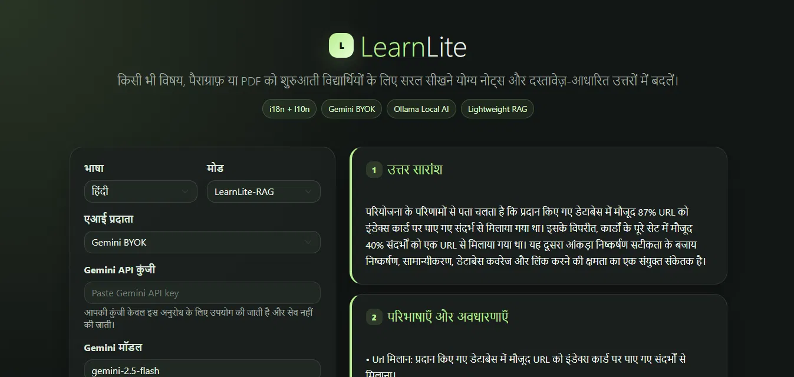
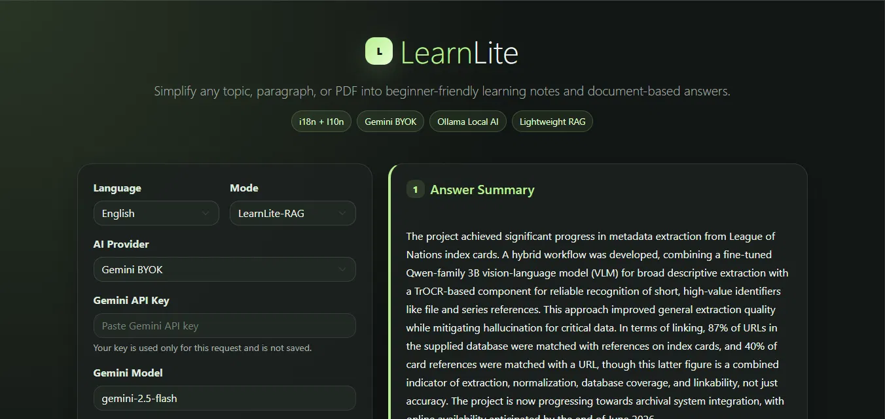

# LearnLite

<p align="center">
  
</p>

<p align="center">
  <b>AI-Powered Multilingual Learning Assistant</b><br>
  Simplify any topic, paragraph, or PDF into beginner-friendly learning notes and document-based answers.
</p>

<p align="center">
  <a href="https://learn-lite-plum.vercel.app">🌐 Live Demo</a>
</p>

---

## Screenshots

### LearnLite Mode — English

<p align="center">
  
</p>

### LearnLite Mode — Telugu (l10n)

<p align="center">
  
</p>

### LearnLite-RAG Mode — Hindi (PDF Q&A)

<p align="center">
  
</p>

### LearnLite-RAG Mode — English (PDF Q&A)

<p align="center">
  
</p>

---

## Overview

LearnLite is an AI-powered educational assistant designed to make learning accessible.

It has two modes:

- **LearnLite** — Enter any topic or paragraph and receive structured learning notes instantly.
- **LearnLite-RAG** — Upload a PDF and ask questions answered directly from the document content.

The application supports multiple Indian languages, cloud-based AI through Gemini BYOK (Bring Your Own Key), and fully local AI inference using Ollama — no data leaves your machine.

---

## Features

### LearnLite Mode

Generates structured notes from any topic or paragraph:

- Main Points
- Explain Like I'm 15
- Key Terms & Definitions
- Prerequisites
- What To Learn Next
- Google Search Suggestions

### LearnLite-RAG Mode

Upload a PDF and ask questions. Returns:

- Answer Summary
- Definitions & Concepts
- Relevant PDF Sections
- Further Learning
- Search Suggestions
- Source Evidence from the document

### Multilingual Support (i18n + l10n)

| Language | Script |
|----------|--------|
| English  | Latin  |
| Hindi    | Devanagari |
| Telugu   | Telugu |

The entire UI and AI responses are localized — labels, placeholders, and generated content all adapt to the selected language.

### AI Providers

**Gemini BYOK** — Bring your own Google Gemini API key. Keys are used only for the current request and are never stored.

**Ollama Local AI** — Run inference entirely on your own machine using any locally installed Ollama model. Ideal for privacy-sensitive use cases.

---

## Tech Stack

| Layer      | Technology                  |
|------------|-----------------------------|
| Backend    | Python, Flask               |
| Frontend   | HTML5, CSS3, Bootstrap 5    |
| AI (Cloud) | Google Gemini API           |
| AI (Local) | Ollama                      |
| RAG        | PyMuPDF4LLM, keyword-scored section retrieval |
| Deployment | Vercel                      |

---

## How It Works

### LearnLite Mode

1. Select a language.
2. Choose an AI provider (Gemini or Ollama).
3. Enter a topic or paragraph (max 700 words).
4. Click **Explain**.
5. Receive structured learning notes instantly.

### LearnLite-RAG Mode

1. Select a language.
2. Choose an AI provider.
3. Switch mode to **LearnLite-RAG**.
4. Upload a PDF (max 10 MB).
5. Type a question about the document.
6. Click **Ask Document**.
7. Receive answers grounded in the document's content.

---

## Running Locally

### Clone Repository

```bash
git clone https://code.swecha.org/vaishnavi_bhan_swecha/learnlite.git
cd learnlite
```

### Install Dependencies

```bash
pip install -r requirements.txt
```

### Configure Environment

```bash
cp .env.example .env
# Add your GEMINI_API_KEY to .env (optional — can also be entered in the UI)
```

### Run Application

```bash
python app.py
```

Open: [http://127.0.0.1:5000](http://127.0.0.1:5000)

---

## Ollama Setup (Optional)

Install [Ollama](https://ollama.com) and pull a model:

```bash
ollama pull llama3.2:1b
```

Start Ollama, then select **Ollama Local AI** inside LearnLite.

> Ollama inference is only available when running LearnLite locally. The Vercel deployment uses Gemini BYOK only.

---

## Project Structure

```
learnlite/
│
├── app.py              # Flask routes and request handling
├── ai.py               # AI provider logic (Gemini + Ollama)
├── rag.py              # RAG pipeline (context retrieval + prompt)
├── pdf_utils.py        # PDF extraction and section scoring
├── translations.py     # i18n/l10n strings
├── requirements.txt
├── pyproject.toml
│
├── assets/
│   ├── gp1.PNG
│   ├── gp2.png
│   ├── gp3.png
│   ├── gp4.png
│   └── LearnLite_Main_Points.png
│
├── templates/
│   └── index.html
│
├── specs/
│   └── multilingual-learning-assistant/
│       └── spec.md
│
└── .specify/
    ├── memory/constitution.md
    └── templates/
```

---

## Live Deployment

[https://learn-lite-plum.vercel.app](https://learn-lite-plum.vercel.app)

> The live deployment supports Gemini BYOK only. Ollama Local AI requires a local setup.

---

## Author

**Vaishnavi Bhan**

- Swecha: [code.swecha.org/vaishnavi_bhan_swecha](https://code.swecha.org/vaishnavi_bhan_swecha)
- GitHub: [github.com/Via-01](https://github.com/Via-01)

---

## License

GNU Affero General Public License v3.0 — see [LICENSE](LICENSE) for details.
