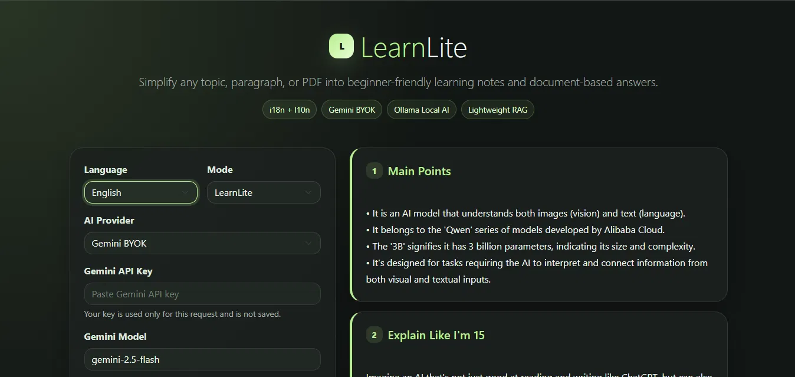

# LearnLite

  
  

  <b>AI-Powered Learning Assistant</b> 
  Transform complex topics and paragraphs into beginner-friendly learning notes.

  <a href="https://learn-lite-plum.vercel.app">Live Demo</a>

---

Overview

LearnLite is an AI-powered educational assistant designed to simplify learning.

Users can enter a topic or paste a paragraph, and LearnLite generates structured learning notes that make complex concepts easier to understand.

The application supports multiple Indian languages, cloud-based AI through Gemini BYOK (Bring Your Own Key), and local AI inference using Ollama.

---

Features

Learning Assistance

LearnLite automatically generates:

- Main Points
- Explain Like I'm 15
- Key Terms & Definitions
- Prerequisites
- What To Learn Next
- Google Search Suggestions

Multilingual Support

- English
- Hindi
- Telugu

Built using internationalization (i18n) and localization (l10n) principles.

AI Providers

Gemini BYOK

Users can provide their own Gemini API key and generate responses using Google's Gemini models.

Ollama Local AI

Supports privacy-friendly local inference through Ollama using locally installed models.

---

Tech Stack

Backend

- Flask
- Python

Frontend

- HTML5
- CSS3
- Bootstrap 5

AI

- Google Gemini API
- Ollama

Deployment

- Vercel

---

How It Works

1. Select a language.
2. Choose an AI provider.
3. Enter a topic or paragraph.
4. Click Explain.
5. Receive structured learning notes instantly.

---

Running Locally

Clone Repository

git clone https://github.com/Via-01/LearnLite.git
cd LearnLite

Install Dependencies

pip install -r requirements.txt

Run Application

python app.py

Open:

http://127.0.0.1:5000

---

Ollama Setup (Optional)

Install Ollama and pull a model:

ollama pull llama3.2 
(or llama3.2:1b)

Start Ollama and select Ollama Local AI inside LearnLite.

---

Live Deployment

https://learn-lite-plum.vercel.app

---

Project Structure

LearnLite/
│
├── app.py
├── ai.py
├── translations.py
├── requirements.txt
│
├── assets/
│ └── gp1.png
│
├── templates/
│ └── index.html
│
└── README.md

---

Author

Vaishnavi Bhan

Swecha Profile:
https://code.swecha.org/vaishnavi_bhan_swecha

GitHub:
https://github.com/Via-01

---

License

This project was developed as part of a hackathon submission for educational purposes.
